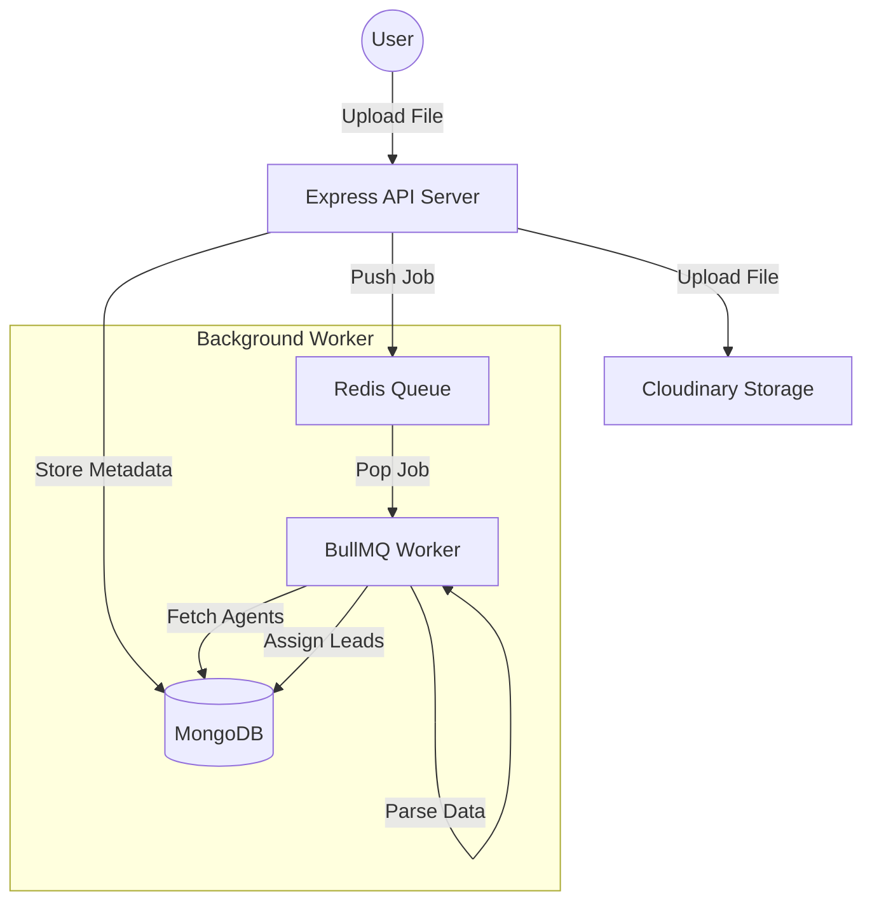
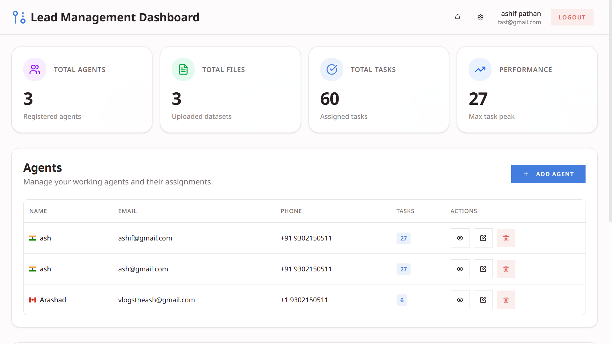
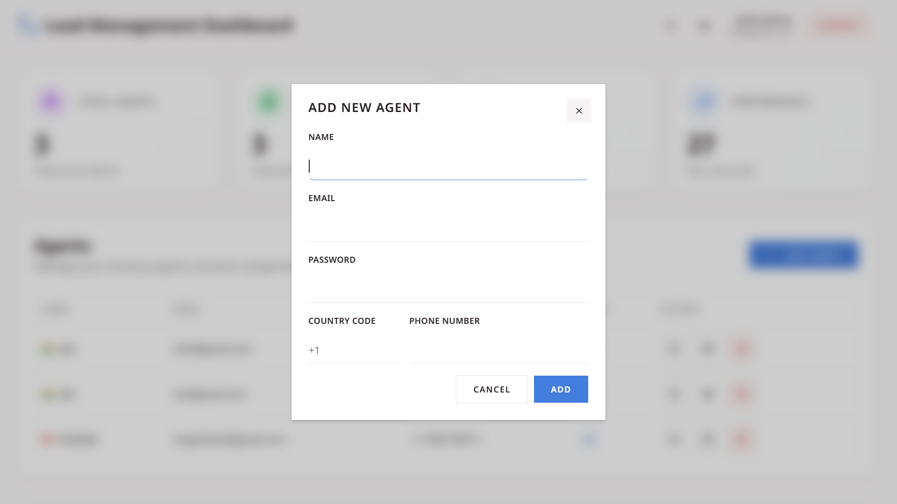
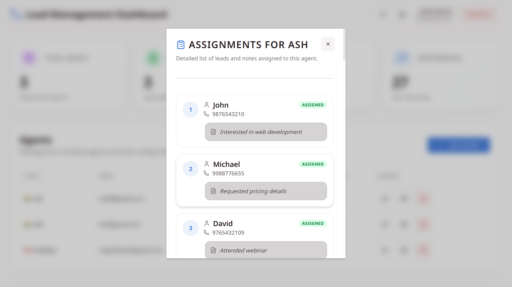
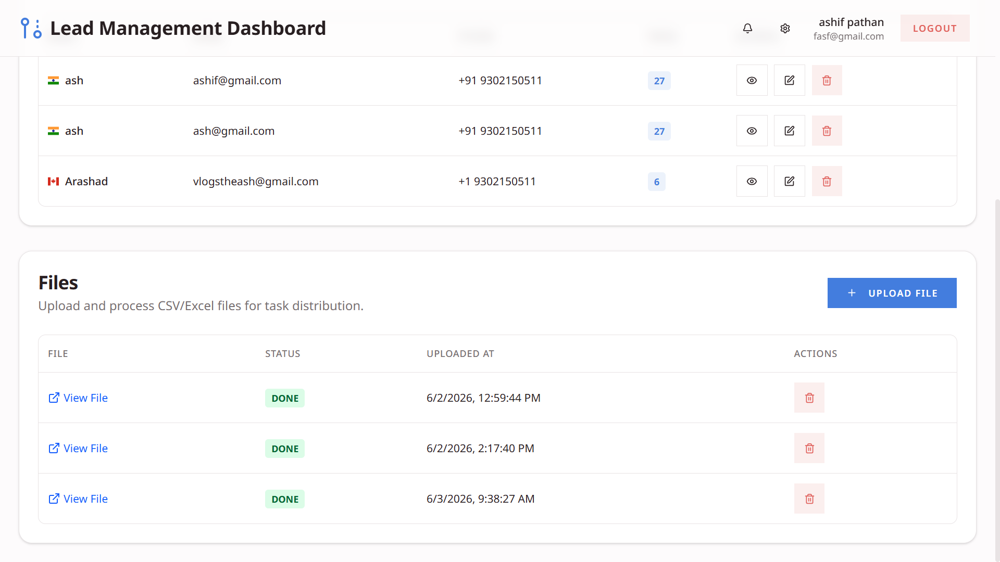
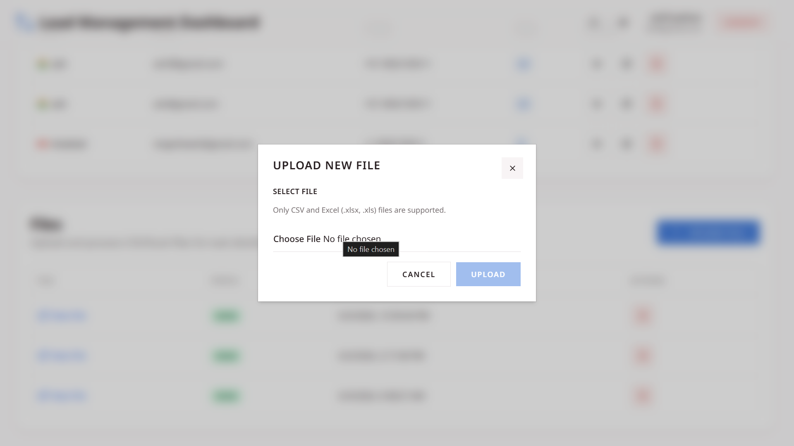

# Distributed Agent Management System

A high-performance Lead Distribution System built with the MERN stack. This system allows users to manage multiple agents and distribute tasks (leads) from uploaded spreadsheets across them using a distributed worker architecture.

## 🚀 Live Demo

**Frontend URL:** [https://assesment-cstech.onrender.com](https://assesment-cstech.onrender.com)
**Demo Video URL:**[https://drive.google.com/file/d/1QWWRiE1EBABUaQYmaJ9b0EV34dpGJAib/view?usp=sharing](https://drive.google.com/file/d/1QWWRiE1EBABUaQYmaJ9b0EV34dpGJAib/view?usp=sharing)

---

## ✨ Features

- **User Authentication**: Secure signup and login using JWT and Argon2 hashing.
- **Agent Management**: Create, update, and delete agents.
- **Task Distribution**: Upload `.xlsx` or `.csv` files and automatically distribute leads to agents.
- **Distributed Architecture**: Uses Redis and BullMQ to handle large-scale processing in the background.
- **Real-time Status**: Track file processing status (Pending, Processing, Done, Failed).

---

## 🛠️ Tech Stack

### Frontend

- **Framework**: React.js (Vite)
- **Language**: TypeScript
- **Styling**: Tailwind CSS
- **State/API**: Axios, React Hooks
- **UI Components**: Lucide-React, React Hot Toast

### Backend

- **Runtime**: Node.js
- **Framework**: Express.js
- **Database**: MongoDB (Mongoose)
- **Queue System**: BullMQ with Redis
- **File Storage**: Cloudinary
- **Security**: JWT (Authentication), Argon2 (Hashing)

---

## 🏗️ Architecture & Distribution Logic

The project follows a distributed worker pattern to ensure that file processing doesn't block the main API thread.

### Distribution Workflow

1. **Upload**: User uploads a lead spreadsheet through the dashboard.
2. **Persistence**: The file is stored on Cloudinary, and a record is created in MongoDB with a `PENDING` status.
3. **Queuing**: A job is added to the **Redis Job Queue** via BullMQ.
4. **Processing**: A dedicated background worker picks up the job, parses the spreadsheet data, and identifies the user's active agents.
5. **Distribution**: Leads are distributed to agents using a **Round-Robin** algorithm, ensuring an even workload.
6. **Completion**: Once distributed, the file status is updated to `DONE`.

### Architecture Diagram

---

## 📸 Screenshots

### Dashboard & Analytics

### Agent Management

### Assigned Task

### File View

### File handling

---

## ⚙️ Installation & Setup

### Prerequisites

- Node.js installed
- MongoDB URI
- Redis instance (for BullMQ)
- Cloudinary credentials

### Backend Setup

1. Navigate to the `BACKEND` directory.
2. Install dependencies: `npm install`
3. Create a `.env` file based on `.env.example`.
4. Build the project: `npm run build`
5. Start the server: `npm run start`

### Frontend Setup

1. Navigate to the `FRONTEND` directory.
2. Install dependencies: `npm install`
3. Create a `.env` file with `VITE_BASE_URL`.
4. Start the development server: `npm run dev`
